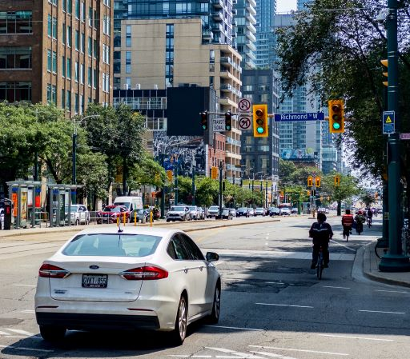
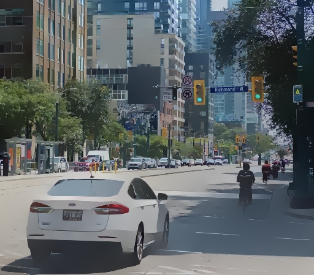

# ILS Smoothing

A Python implementation of "[Real-time Image Smoothing via Iterative Least Squares](https://arxiv.org/abs/2003.07504)".
This paper looked interesting and I wanted to see if I could implement it since
the reference implementation is Matlab.

This is an example of an "edge-preserving blur", where the filter can be tuned
to keep some image details but remove others.

|Original|ILS Filtered|
|--------|--------|
||

The general idea is that smoothing is a special case of a weighted average,
which is exactly what a 2D blur filter *is*.  That, in turn, means you can treat
blurring as a kind of regression problem where you're trying minimize a cost
function that looks like

```math
E = \|\bar{I}(x,y) - I(x,y)\|^2 + \lambda f\{I(x,y)\}
```

where $I(x,y)$ is the original image, $\bar{I}(x,y)$ is the smoothed image and
$f\{I(x,y)\}$ is a regularization function.  Without $f\left\{\cdot\right\}$ you
just end up with the average value of the image.  However, depending on how you
choose $f\left\{\cdot\right\}$, you can cause the smoothing to respect
particularly strong edges.

Now, this is what most edge-preserving filters end up doing.  Where this paper
is different is that its method is easy to parallelize on a GPU while producing
comparable results to more complicated algorithms.

## Installation

Make sure that you have [conda](https://docs.conda.io/en/latest/) installed
since that's used for the environment setup.  Otherwise there aren't any special
requirements.

You just need to run the following to install the `ils_smoothing` package:

```bash
conda env create
conda activate ils-smoothing
pip install .
```

## Usage

Just use

```bash
ils input.jpg output.jpg
```

to filter `input.jpg` and produce `output.jpg`.  You can see the available
options with

```bash
ils --help
```
